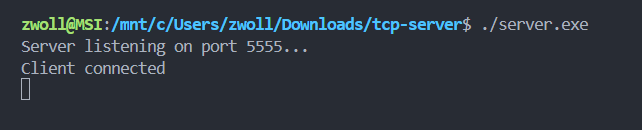
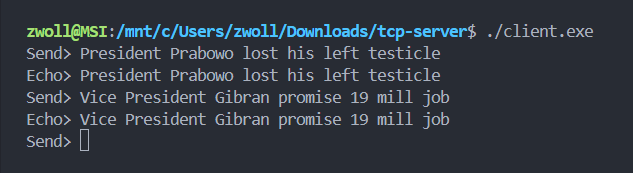
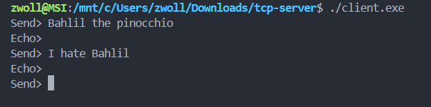
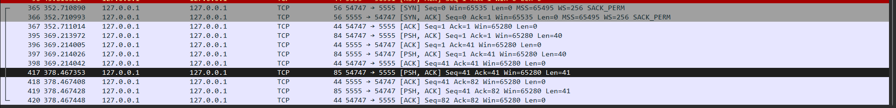
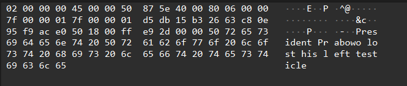
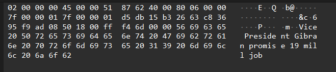

## when the server running, the server will listen & wait on port 5555, & when the client is running, it will print "client connected"

## client can send a message (echo) & will get response message (echo) into themself from server

## when the server aren't running any response wouldn't be given into the client

## captured TCP protocol in wireshark in port 5555 (plain text)
 

## 1st echo (prabowo & his testicle) (plain text)

## 2nd echo (gibran & 19 mill promises) (plain text)
